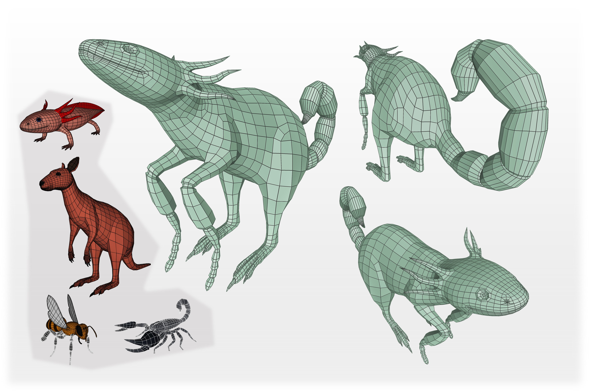

# QuadMixer: Layout Preserving Blending of Quadrilateral Meshes

Stefano Nuvoli, Alex Hernandez, Claudio Esperança, [Riccardo Scateni](http://people.unica.it/riccardoscateni/), [Paolo Cignoni](http://vcg.isti.cnr.it/~cignoni/), [Nico Pietroni](https://profiles.uts.edu.au/Nico.Pietroni)<br/>
*SIGGRAPH Asia 2019*<br/>



## Abstract
We propose QuadMixer, a novel interactive technique to compose quad mesh components preserving the majority of the original layouts. Quad Layout is a crucial property for many applications since it conveys important information that would otherwise be destroyed by techniques that aim only at preserving shape. Our technique keeps untouched all the quads in the patches which are not involved in the blending. We first perform robust boolean operations on the corresponding triangle meshes. Then we use this result to identify and build new surface patches for small regions neighboring the intersection curves. These blending patches are carefully quadrangulated respecting boundary constraints and stitched back to the untouched parts of the original models. The resulting mesh preserves the designed edge flow that, by construction, is captured and incorporated to the new quads as much as possible. We present our technique in an interactive tool to show its usability and robustness.

DOI: [10.1145/3355089.3356542](https://doi.org/10.1145/3355089.3356542) ACM Transactions on Graphics (SIGGRAPH Asia), 2019

**BibTex**
```
@article{10.1145/3355089.3356542,
author = {Nuvoli, Stefano and Hernandez, Alex and Esperan\c{c}a, Claudio and Scateni, Riccardo and Cignoni, Paolo and Pietroni, Nico},
title = {QuadMixer: Layout Preserving Blending of Quadrilateral Meshes},
year = {2019},
issue_date = {November 2019},
publisher = {Association for Computing Machinery},
address = {New York, NY, USA},
volume = {38},
number = {6},
issn = {0730-0301},
url = {https://doi.org/10.1145/3355089.3356542},
doi = {10.1145/3355089.3356542},
abstract = {We propose QuadMixer, a novel interactive technique to compose quad mesh components preserving the majority of the original layouts. Quad Layout is a crucial property for many applications since it conveys important information that would otherwise be destroyed by techniques that aim only at preserving shape.Our technique keeps untouched all the quads in the patches which are not involved in the blending. We first perform robust boolean operations on the corresponding triangle meshes. Then we use this result to identify and build new surface patches for small regions neighboring the intersection curves. These blending patches are carefully quadrangulated respecting boundary constraints and stitched back to the untouched parts of the original models. The resulting mesh preserves the designed edge flow that, by construction, is captured and incorporated to the new quads as much as possible. We present our technique in an interactive tool to show its usability and robustness.},
journal = {ACM Trans. Graph.},
month = {nov},
articleno = {180},
numpages = {13},
keywords = {mesh modelling, retopology, quadrangulation}
}
```

### Download
```bash
git clone --recursive https://github.com/stefanonuvoli/quadmixer
```

### Build
Install the libraries eigen, boost and gurobi. 
In Ubuntu you can install boost and eigen easily with the following terminal commands:
```
sudo apt-get install libeigen3-dev
sudo apt-get install libboost-dev
```
Open the file configuration.pri and set the paths of the requested libraries and the gurobi parameters:
```
#External libraries
GL_PATH             = /usr/include/GL
EIGEN_PATH          = /usr/include/eigen3
BOOST_PATH          = /usr/include/boost
GUROBI_PATH         = /opt/gurobi903/linux64
GUROBI_COMPILER     = gurobi_g++5.2
GUROBI_LIB          = gurobi90
```
You can now compile the project quadmixer.pro with qmake or QtCreator.<br/>
<br /><br/>
In case you have technical issues or building problems, please write to [stefano.nuvoli@gmail.com](mailto:stefano.nuvoli@gmail.com) or [nico.pietroni@uts.edu.au](mailto:nico.pietroni@uts.edu.au).

## Note
The code has slightly changed and the results could be different from the ones showed in the paper.

## License
[GPL3](LICENSE) licensed
([FAQ](https://www.gnu.org/licenses/gpl-faq.html))


